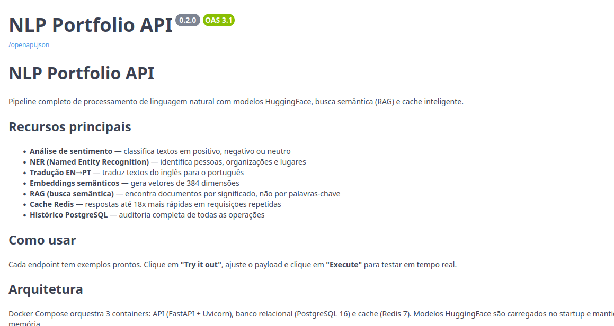
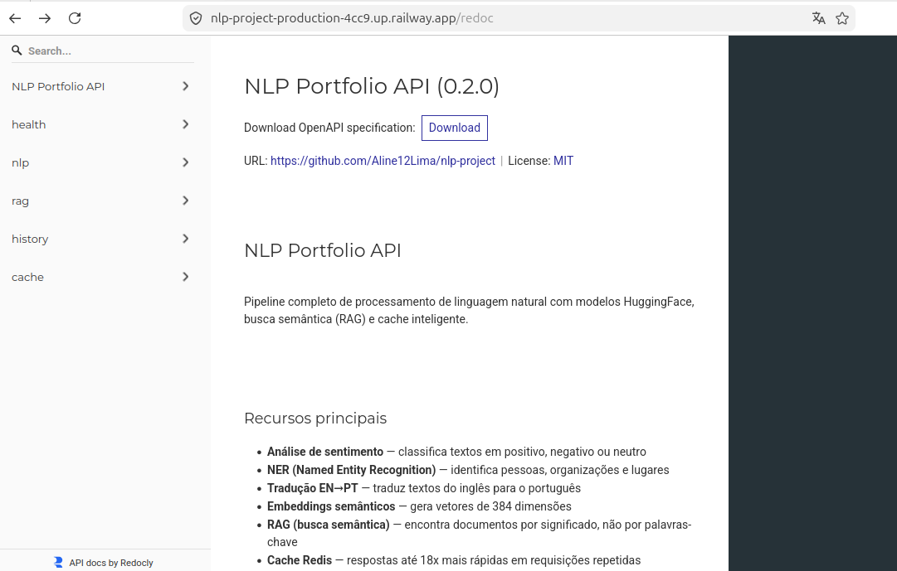
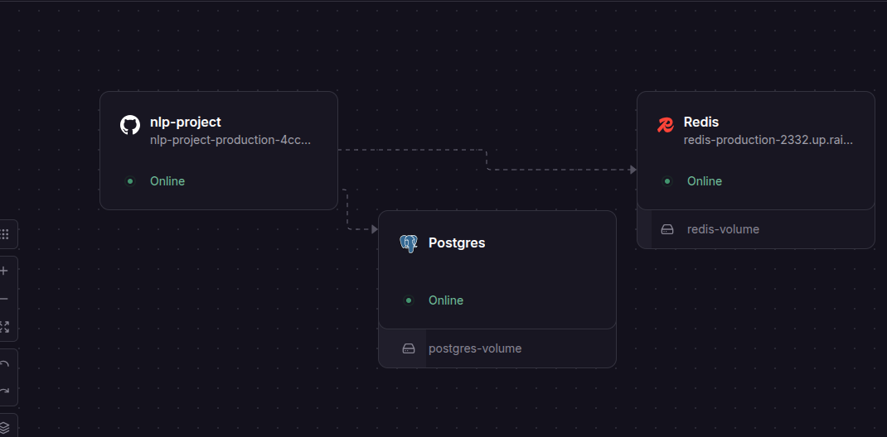
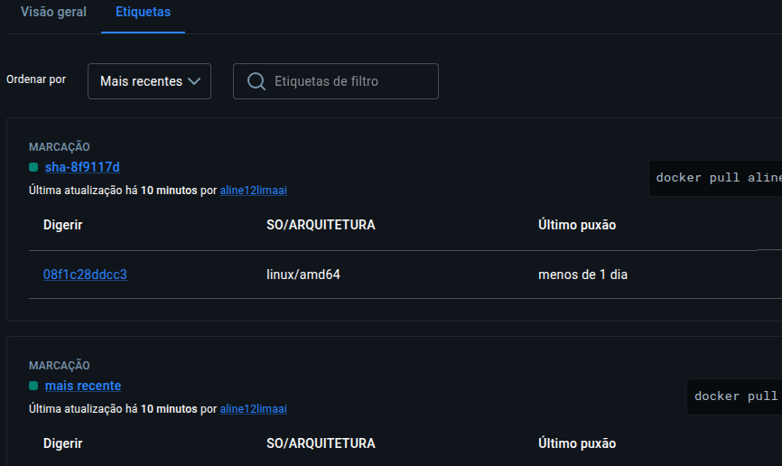
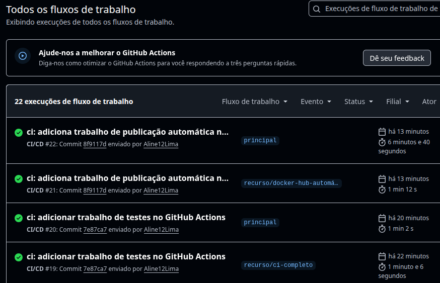
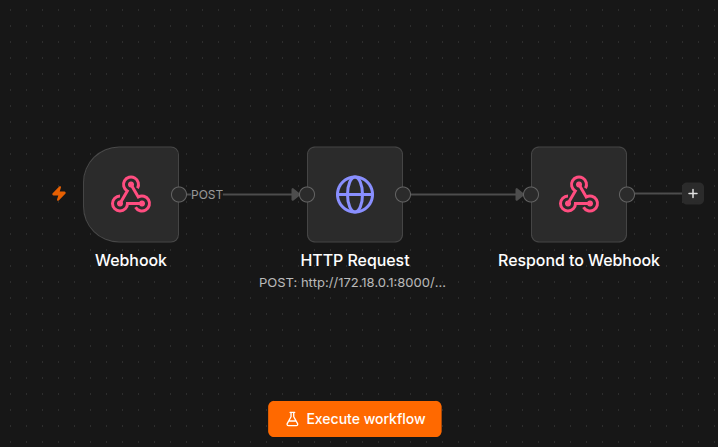

<div align="center">

# 🤖 NLP Portfolio API

### API de IA construída do zero: 4 modelos ML, RAG, cache e CI/CD em produção


### 🌐 [Testar a API em Produção](https://nlp-project-production-4cc9.up.railway.app/docs)

</div>

---

## 📖 Sobre o projeto

Pipeline completo de processamento de linguagem natural (NLP) construído do zero para portfólio, demonstrando habilidades de **engenharia de ML em produção**. A API integra 4 modelos pré-treinados do HuggingFace, implementa busca semântica (RAG) com ChromaDB, cache inteligente com Redis (18x speedup mensurado), histórico persistente em PostgreSQL, e é entregue via CI/CD completo com deploy automatizado.

O projeto foi desenvolvido em **4 fases estruturadas**, cada uma com sua própria complexidade técnica, seguindo o padrão profissional de branches Git e conventional commits. Desafios reais foram enfrentados durante o desenvolvimento — desde conflitos de dependências até otimização de memória em produção — todos documentados na seção **Desafios e Soluções**.

---

## 🚀 Testando em produção

A API está no ar 24/7:

| Interface | URL |
|-----------|-----|
| 📘 **Swagger UI (interativo)** | [/docs](https://nlp-project-production-4cc9.up.railway.app/docs) |
| 📗 **ReDoc (leitura)** | [/redoc](https://nlp-project-production-4cc9.up.railway.app/redoc) |
| ❤️ **Health Check** | [/health/](https://nlp-project-production-4cc9.up.railway.app/health/) |
| 📊 **Métricas Prometheus** | [/metrics](https://nlp-project-production-4cc9.up.railway.app/metrics) |

### Exemplo rápido — análise de sentimento

```bash
curl -X POST https://nlp-project-production-4cc9.up.railway.app/nlp/sentiment \
  -H "Content-Type: application/json" \
  -d '{"text": "This project is amazing!"}'
```

**Resposta:**
```json
{
  "text": "This project is amazing!",
  "label": "positive",
  "score": 0.9861
}
```

> 💡 A primeira chamada de cada endpoint pode demorar ~30s (lazy loading dos modelos). Chamadas seguintes retornam em milissegundos.

---

## 🧰 Stack técnico

### Backend & API
- **[Python 3.11](https://www.python.org/)** — linguagem principal
- **[FastAPI](https://fastapi.tiangolo.com/)** — framework web assíncrono
- **[Uvicorn](https://www.uvicorn.org/)** — servidor ASGI
- **[Pydantic](https://docs.pydantic.dev/)** — validação de dados

### Machine Learning & NLP
- **[HuggingFace Transformers](https://huggingface.co/docs/transformers)** — modelos pré-treinados
- **[PyTorch](https://pytorch.org/)** — backend ML (CPU-only)
- **[sentence-transformers](https://www.sbert.net/)** — geração de embeddings

### Persistência
- **[PostgreSQL 16](https://www.postgresql.org/)** — banco relacional (histórico)
- **[Redis 7](https://redis.io/)** — cache em memória
- **[ChromaDB](https://www.trychroma.com/)** — banco vetorial (RAG)
- **[SQLAlchemy 2](https://www.sqlalchemy.org/)** — ORM

### DevOps & Infraestrutura
- **[Docker](https://www.docker.com/)** — containerização (multi-stage build)
- **[Docker Compose](https://docs.docker.com/compose/)** — orquestração local
- **[Docker Hub](https://hub.docker.com/r/aline12limaai/nlp-portfolio)** — registry de imagens
- **[Railway](https://railway.app/)** — deploy em produção
- **[GitHub Actions](https://github.com/features/actions)** — CI/CD
- **[Prometheus](https://prometheus.io/)** — métricas
- **[Ruff](https://docs.astral.sh/ruff/)** — lint e formatação

### Qualidade & Testes
- **[Pytest](https://pytest.org/)** — testes automatizados
- **Conventional Commits** — padronização Git
- **Git Flow** — branches feature/*, merge para main

### Automação & Orquestração
- **[n8n](https://n8n.io/)** — workflows visuais integrando a API

---

## 🏗️ Arquitetura
┌─────────────────────────────────────────────────────┐
│              🌐 FastAPI (0.0.0.0:8000)              │
│  ┌──────────┬──────────┬────────┬──────┬────────┐   │
│  │   NLP    │   RAG    │History │Cache │ Health │   │
│  │ router   │ router   │ router │router│ router │   │
│  └────┬─────┴────┬─────┴───┬────┴──┬───┴────────┘   │
│       │          │         │       │                │
│  ┌────▼──────────▼─────────▼───────▼─────┐          │
│  │  Serviços (chroma, redis, history)    │          │
│  └────┬──────────┬─────────┬─────────────┘          │
│       │          │         │                        │
└───────┼──────────┼─────────┼────────────────────────┘
│          │         │
┌────▼──┐   ┌──▼───┐  ┌──▼────┐
│Chroma │   │Redis │  │Postgres│
│  DB   │   │Cache │  │  DB   │
└───────┘   └──────┘  └───────┘
↑
│ Ingestão de docs
│
┌────┴───────┐
│ Embeddings │
│ HuggingFace│
└────────────┘
**3 containers Docker orquestrados:**
- `api` — FastAPI + Uvicorn + 4 modelos HuggingFace + ChromaDB embarcado
- `postgres` — PostgreSQL 16 para histórico de operações
- `redis` — Redis 7 para cache em memória

---

## 📸 Interface e visualização

### Swagger UI (interativo)


### ReDoc (documentação de leitura)


### Deploy no Railway


### Docker Hub — Publicação automática via CI


### CI/CD verde no GitHub Actions


### Integração com n8n (workflow visual)


---

## ⚡ Funcionalidades

### 🧠 Modelos de IA (HuggingFace)

| Tarefa | Modelo | Exemplo |
|--------|--------|---------|
| **Análise de sentimento** | `cardiffnlp/twitter-roberta-base-sentiment-latest` | "I love this!" → `positive (98.6%)` |
| **NER (entidades nomeadas)** | `dbmdz/bert-large-cased-finetuned-conll03-english` | "Aline works at Google" → `PER, ORG` |
| **Tradução EN→PT** | `Helsinki-NLP/opus-mt-tc-big-en-pt` | "Hello world" → `Olá mundo` |
| **Embeddings semânticos** | `sentence-transformers/all-MiniLM-L6-v2` | Texto → vetor 384 dimensões |

### 🔍 RAG (busca semântica)
Adicione documentos e busque por **significado**, não por palavras-chave. Query "linguagem rápida" encontra "framework Python moderno" — sem palavras em comum, apenas similaridade semântica.

### ⚡ Cache Redis
Todas as operações NLP passam por cache antes de rodar o modelo. Segundas chamadas retornam em **~50ms** (vs ~900ms sem cache — **18x mais rápido**).

### 📚 Histórico completo
Toda operação é auditada no PostgreSQL: timestamp, tipo, texto de entrada, resultado JSON. Consultável via endpoint `/history/`.

### 📊 Métricas Prometheus
Endpoint `/metrics` exposto para integração com sistemas de monitoramento (contadores de requisições, latência p50/p95/p99, códigos de status).

---

## 🗺️ Roadmap — 4 fases estruturadas

### ✅ Fase 1 — Setup e base (Semanas 1-2)
- Estrutura profissional de pastas
- FastAPI com Swagger automático
- Containerização com Docker + docker-compose
- Primeiro modelo HuggingFace integrado (sentimento)
- Testes automatizados com pytest (6 testes)
- Git com conventional commits
- CI básico com lint (ruff)

### ✅ Fase 2 — Pipeline NLP completo (Semanas 3-4)
- +3 modelos HuggingFace (NER, tradução, embeddings)
- **ChromaDB** como banco vetorial embarcado
- **RAG** — busca por similaridade semântica
- **PostgreSQL** como container separado
- Camada de serviços (`app/services/`)
- Camada de banco (`app/database/` com SQLAlchemy)
- Volumes Docker persistentes

### ✅ Fase 3 — Orquestração e integrações (Semanas 5-6)
- Workflow **n8n** integrando webhook externo à API
- **Redis** para cache (18x speedup mensurado)
- Endpoints de administração de cache
- Documentação Swagger enriquecida
- **ReDoc** como interface alternativa

### ✅ Fase 4 — MLOps e deploy (Semanas 7-8)
- **Métricas Prometheus** (endpoint `/metrics`)
- **Docker Hub** — publicação automática via CI
- **Otimização Docker** — imagem reduzida em **76%** (9.6GB → 2.28GB) com multi-stage build e torch CPU-only
- **CI/CD completo** — GitHub Actions com lint + testes + auto-publish
- **Deploy Railway** com URL pública 24/7
- Lazy loading dos modelos para economizar RAM

---

## 🐛 Desafios e soluções

Bugs reais enfrentados e resolvidos durante o desenvolvimento. Este é o valor de construir um projeto de verdade, não seguir tutorial.

### 1. `numpy 1.24` quebrou o ChromaDB
**Sintoma:** `AttributeError: module 'numpy' has no attribute 'float'`
**Causa:** `chroma-hnswlib` usava `np.float`, deprecated no numpy 1.24+
**Solução:** Fixar `numpy==1.23.5` no `requirements.txt`

### 2. Modelo `opus-mt-pt-en` foi removido do HuggingFace
**Sintoma:** `HTTPError: 404 Not Found` ao baixar
**Causa:** Modelo foi depreciado sem aviso
**Solução:** Migrar para `Helsinki-NLP/opus-mt-tc-big-en-pt` e ajustar direção (EN→PT)

### 3. Cache do HuggingFace duplicado
**Sintoma:** Modelos baixavam em pastas diferentes a cada execução
**Causa:** `HF_HOME` não estava definido
**Solução:** Adicionar `HF_HOME=/app/models` no docker-compose

### 4. Conflito de porta 5432 (PostgreSQL)
**Sintoma:** `Bind for 0.0.0.0:5432 failed: port is already allocated`
**Causa:** Container do n8n já usava a porta
**Solução:** Mapear PostgreSQL para `5433:5432` externamente

### 5. Pasta `app/models/` ignorada pelo Git
**Sintoma:** `ModuleNotFoundError: No module named 'app.models'` em produção
**Causa:** Regra `models/` no `.gitignore` (sem barra inicial) excluía qualquer pasta com esse nome
**Solução:** Trocar por `/models/` (só a raiz) e forçar commit com `git add -f`

### 6. Railway definia PORT 8080, API rodava na 8000
**Sintoma:** "Application failed to respond" na URL pública
**Causa:** Railway usa variável `PORT` dinâmica; o CMD do Dockerfile estava fixo em 8000
**Solução:** Trocar CMD para `uvicorn ... --port ${PORT:-8000}` (aceita variável ou fallback)

### 7. Out of Memory no Railway
**Sintoma:** Container morria com "Killed" ao carregar modelos
**Causa:** Free tier tem 512MB RAM; 4 modelos consomem ~4GB
**Solução:** **Lazy loading** — modelos carregam sob demanda, não no startup

### 8. Imagem Docker de 9.6GB
**Sintoma:** Deploy lento, difícil compartilhar
**Solução:** **Multi-stage build** + `torch` CPU-only + `.dockerignore` otimizado → **2.28GB (-76%)**

---

## 🏃 Como rodar localmente

### Pré-requisitos
- Docker + Docker Compose

### Passo a passo

```bash
# 1. Clone o repositório
git clone https://github.com/Aline12Lima/nlp-project.git
cd nlp-project

# 2. Crie o .env a partir do exemplo
cp .env.example .env

# 3. Suba os containers
docker compose up --build

# 4. Aguarde ~2-3 min na primeira execução (baixa modelos ~2GB)
# Quando aparecer "Application startup complete", abra:
# http://localhost:8000/docs
```

### Testando

```bash
# Health check
curl http://localhost:8000/health/

# Análise de sentimento
curl -X POST http://localhost:8000/nlp/sentiment \
  -H "Content-Type: application/json" \
  -d '{"text": "I love this project!"}'

# Rodar testes
docker compose exec api pytest app/tests/ -v
```

### Usando a imagem do Docker Hub (sem clonar)

```bash
docker pull aline12limaai/nlp-portfolio:latest
docker run -p 8000:8000 aline12limaai/nlp-portfolio:latest
```

---

## 📡 Endpoints principais

### NLP (com cache)
| Método | Rota | Descrição |
|--------|------|-----------|
| POST | `/nlp/sentiment` | Análise de sentimento |
| POST | `/nlp/ner` | Reconhecimento de entidades |
| POST | `/nlp/translate` | Tradução EN→PT |
| POST | `/nlp/embeddings` | Vetor semântico (384 dim) |

### RAG (busca semântica)
| Método | Rota | Descrição |
|--------|------|-----------|
| POST | `/rag/documents` | Adiciona documento indexado |
| POST | `/rag/search` | Busca por similaridade |
| GET | `/rag/stats` | Total de documentos |

### Histórico e cache
| Método | Rota | Descrição |
|--------|------|-----------|
| GET | `/history/` | Lista operações realizadas |
| GET | `/cache/stats` | Estatísticas do Redis |
| DELETE | `/cache/clear` | Limpa cache |

### Observabilidade
| Método | Rota | Descrição |
|--------|------|-----------|
| GET | `/health/` | Health check |
| GET | `/metrics` | Métricas Prometheus |
| GET | `/docs` | Swagger UI |
| GET | `/redoc` | ReDoc |

---

## 📊 Métricas de performance

| Métrica | Valor |
|---------|-------|
| **Tamanho da imagem Docker** | 2.28 GB (**-76%** vs versão inicial) |
| **Speedup com cache Redis** | ~18x (911ms → 49ms) |
| **Modelos HuggingFace** | 4 (carregamento lazy) |
| **Dimensões dos embeddings** | 384 |
| **Testes automatizados** | 6 (pytest) |
| **Cobertura CI** | Lint + Testes + Deploy |
| **Tempo médio de CI** | ~1min 30s (com cache) |
| **Uptime em produção** | 24/7 (Railway) |

---

## 🔮 Melhorias futuras

- [ ] **Frontend SaaS** — aplicação consumindo esta API (projeto em planejamento)
- [ ] **Integração Telegram Bot** — chatbot conectado via n8n (adiado para pós-deploy)
- [ ] **Testes de integração** — rodar Postgres/Redis em containers no CI
- [ ] **Rate limiting** — proteção contra abuso via Redis
- [ ] **Autenticação JWT** — para endpoints sensíveis
- [ ] **Volume persistente para modelos** no Railway (evitar re-download)
- [ ] **Deploy multi-região** para menor latência

---

## 📜 Licença

Distribuído sob a licença MIT. Veja [LICENSE](LICENSE) para detalhes.

---

## 👤 Autor

**Aline Lima**

- 🐙 GitHub: [@Aline12Lima](https://github.com/Aline12Lima)
- 💼 LinkedIn: [Aline Lima] (https://www.linkedin.com/in/aline-lima-397a84202/)
- 🐋 Docker Hub: [@aline12limaai](https://hub.docker.com/u/aline12limaai)

---

<div align="center">

**Se este projeto te inspirou ou ajudou, considere dar uma ⭐!**

Construído com ☕ + muita persistência através de bugs reais em produção.

</div>